# Cartograph: HTTP Proxy for Internet Mapping

## Introduction

Cartograph is an advanced proxy that maps HTTP networks. It is designed to aid in cybersecurity assessments and research
through high performance data collection and visualization of web ecosystems.

## System Overview

The following diagram illustrates Cartograph's logical system architecture and data flow:

```mermaid
flowchart TD
    %% User and Applications
    User[👤 User]
    Browser[🌐 Browser/App]
    
    %% Cartograph System
    Proxy[🔄 Cartograph Proxy<br/>Port 8080]
    WebUI[💻 Web Interface<br/>Port 80/443]
    API[🔌 REST API<br/>Port 8000]
    
    %% Data Storage and Processing
    Database[(📊 Database<br/>Collected Data)]
    ML[🤖 Machine Learning<br/>Analysis & Training]
    
    %% External Web
    Internet[🌍 Internet<br/>Websites & APIs]
    
    %% User Interactions
    User -->|Configure targets| API
    User -->|Review & classify data| WebUI
    User -->|Export visualizations| API
    
    %% Data Flow
    Browser -->|HTTP/HTTPS traffic| Proxy
    Proxy -->|Intercept & analyze| Internet
    Internet -->|Responses| Proxy
    Proxy -->|Store traffic data| Database
    
    %% Analysis Pipeline
    Database -->|Raw data| ML
    ML -->|Trained models| Database
    WebUI -->|User classifications| Database
    
    %% Configuration
    API -->|Target rules| Proxy
    Database -->|Stored data| WebUI
    Database -->|Export data| API
    
    %% Styling
    classDef user fill:#e8f5e8,stroke:#4caf50,stroke-width:2px
    classDef system fill:#e3f2fd,stroke:#2196f3,stroke-width:2px
    classDef data fill:#fff3e0,stroke:#ff9800,stroke-width:2px
    classDef external fill:#fce4ec,stroke:#e91e63,stroke-width:2px
    
    class User,Browser user
    class Proxy,WebUI,API system
    class Database,ML data
    class Internet external
```

## Web Demo

Experience Cartograph's capabilities firsthand by exploring the following web ecosystems, presented in an interactive
visual interface (*best viewed on a desktop web browser*):

- NFL web ecosystem: [https://demo.proxyproducts.com/nfl](https://demo.proxyproducts.com/nfl)
- Twitch.tv web ecosystem: [https://demo.proxyproducts.com/twitch](https://demo.proxyproducts.com/twitch)
- Warner Media web ecosystem: [https://demo.proxyproducts.com/warnermedia](https://demo.proxyproducts.com/warnermedia)

These interactive demonstrations give you an intuitive view of Cartograph's mapping capabilities, but it is just a small
peek into the type of data that Cartograph captures.

## Getting Started

Check out the complete documentation for detailed instructions on how to install and use
Cartograph - [https://cartograph.thehackerdev.com](https://cartograph.thehackerdev.com).

# Roadmap

Cartograph is a work in progress, with many exciting features and capabilities planned for future releases. Here's a
glimpse of what's to come:

- **Web UI**: Cartograph will feature a web UI for interacting with the proxy and visualizing web ecosystems.
- **Machine Learning**: Cartograph will be able to train on web application and API data, allowing it to identify and
  classify web pages and their associated resources.

# License

Cartograph is licensed under the Proprietary License. You are granted a non-exclusive, non-transferable, revocable license to use the source code strictly for personal, non-commercial purposes. Commercial use and redistribution of the source code are prohibited without explicit written permission.

For more details, refer to the [LICENSE](./LICENSE) file.