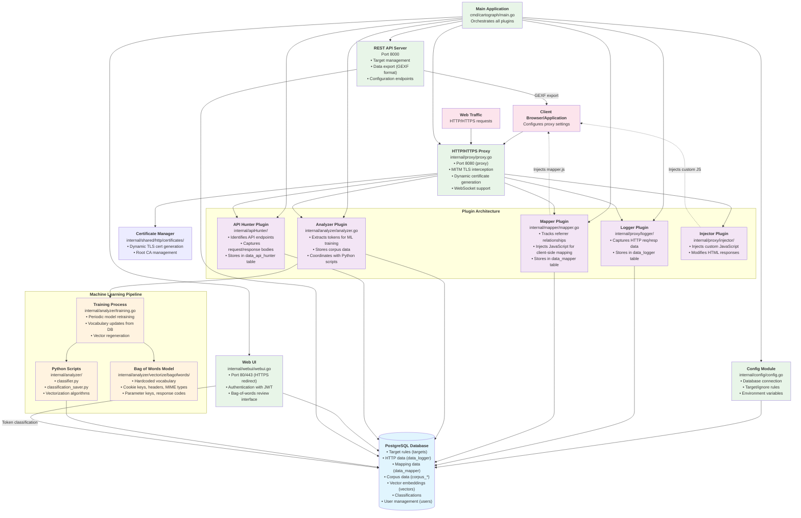

# Cartograph: HTTP Proxy for Internet Mapping

## Introduction

Cartograph is an advanced proxy that maps HTTP networks. It is designed to aid in cybersecurity assessments and research
through high performance data collection and visualization of web ecosystems.

## Architecture Overview

The following diagram illustrates Cartograph's modular architecture and data flow:



## Web Demo

Experience Cartograph's capabilities firsthand by exploring the following web ecosystems, presented in an interactive
visual interface (*best viewed on a desktop web browser*):

- NFL web ecosystem: [https://demo.proxyproducts.com/nfl](https://demo.proxyproducts.com/nfl)
- Twitch.tv web ecosystem: [https://demo.proxyproducts.com/twitch](https://demo.proxyproducts.com/twitch)
- Warner Media web ecosystem: [https://demo.proxyproducts.com/warnermedia](https://demo.proxyproducts.com/warnermedia)

These interactive demonstrations give you an intuitive view of Cartograph's mapping capabilities, but it is just a small
peek into the type of data that Cartograph captures.

## Getting Started

Use the following steps to get Cartograph up and running on your system:

1. Clone the Cartograph repository to your local machine.
2. Build and run Cartograph with Docker Compose.
3. Install and trust the root CA certificates on systems that will be working with Cartograph.
4. Add target hosts to Cartograph in order to start capturing web traffic.

### Cloning the Repository

Clone the Cartograph repository to your local machine by running this command in your terminal:

```bash
git clone https://github.com/TheHackerDev/cartograph.git
```

### Build and Run Cartograph with Docker Compose

Navigate to the `cartograph` directory and run the following command to build and run Cartograph with Docker Compose:

```bash
docker compose up --build
```

This command will build the Cartograph service and its dependencies, and then launch the service.

#### Performance Optimization with Docker Bake

For faster build times, especially during development or when rebuilding frequently, you can use Docker's Bake feature. This enables parallel building of multiple images and improved caching:

```bash
COMPOSE_BAKE=true docker compose up --build
```

### Installing and Trusting Root CA Certificates

In order to capture HTTPS traffic, you need to install and trust the root CA certificates generated by Cartograph. The
root CA certificates are located in the `certificates` directory of the Cartograph repository. They are generated when
the
service is launched and are used to sign the certificates for the HTTPS connections Cartograph intercepts. Install the
root CA certificates on the systems that will be working with Cartograph.

### Managing Target Hosts

#### Adding Target Hosts

After the Cartograph service is launched, you can immediately capture all traffic by adding a wildcard target host. Run
the following `curl` command to configure Cartograph to target all hosts:

```bash
curl -X POST http://127.0.0.1:8000/api/v1/config/targets/ \
     -H 'Content-Type: application/json' \
     -d '{"ignore": false, "hosts": ["***"]}'
```

Upon successful execution, the server will respond with a unique identifier (UUID) for the created target rule. This
UUID is essential for managing the target, such as for subsequent deletion or updates.

#### Targeting Specific Hosts

If you would like to target a specific host, replace `"***"` with the desired host name. For example, to
target `www.example.com`, run this command:

```bash
curl -X POST http://127.0.0.1:8000/api/v1/config/targets/ \
     -H 'Content-Type: application/json' \
     -d '{"ignore": false, "hosts": ["www.example.com"]}'
```

#### Targeting Multiple Hosts

To target multiple hosts in one rule, run this command:

```bash
curl -X POST http://127.0.0.1:8000/api/v1/config/targets/ \
     -H 'Content-Type: application/json' \
     -d '{"ignore": false, "hosts": ["www.example.com", "www.example.org"]}'
```

#### Wildcard Hosts

You can use the wildcard (`***`) anywhere in the host name to target all hosts that match the pattern. For example, to
target all hosts in the `example.com` domain, run this command:

```bash
curl -X POST http://127.0.0.1:8000/api/v1/config/targets/ \
     -H 'Content-Type: application/json' \
     -d '{"ignore": false, "hosts": ["***.example.com"]}'
```

#### Ignoring Hosts

In order to ignore hosts, set the `ignore` field to `true`:

```bash
curl -X POST http://127.0.0.1:8000/api/v1/config/targets/ \
     -H 'Content-Type: application/json' \
     -d '{"ignore": true, "hosts": ["www.example.com"]}'
```

#### Deleting Target Hosts

If you wish to delete a specific target, use the rule's UUID provided in the response when the target was created:

```bash
curl -X DELETE http://127.0.0.1:8000/api/v1/config/targets/?id=TARGET_RULE_UUID
```

Replace `TARGET_RULE_UUID` with the actual UUID received from adding the host. A successful deletion will result in the
same UUID being returned, indicating the target host rule has been removed.

#### Retrieving All Target Hosts

To retrieve all the configured target rules, send a `GET` request to the following endpoint:

```bash
curl http://127.0.0.1:8000/api/v1/config/targets/
```

The server will return a JSON object listing all existing target rules and their respective UUIDs.

This command will return details on all target rules set up in Cartograph, making it easy to manage and review the hosts
you're currently targeting or ignoring.

## Development

For developers who want to contribute to Cartograph or debug the application, see the [Development Guide](development.md) which covers:

- Setting up the debug build with Docker
- Connecting VS Code, Cursor, or Windsurf for debugging
- Development workflow and testing
- Contributing guidelines
- Advanced development topics

# Roadmap

Cartograph is a work in progress, with many exciting features and capabilities planned for future releases. Here's a
glimpse of what's to come:

- **Web UI**: Cartograph will feature a web UI for interacting with the proxy and visualizing web ecosystems.
- **Machine Learning**: Cartograph will be able to train on web application and API data, allowing it to identify and
  classify web pages and their associated resources.

# License

Cartograph is licensed under the Proprietary License. You are granted a non-exclusive, non-transferable, revocable license to use the source code strictly for personal, non-commercial purposes. Commercial use and redistribution of the source code are prohibited without explicit written permission.